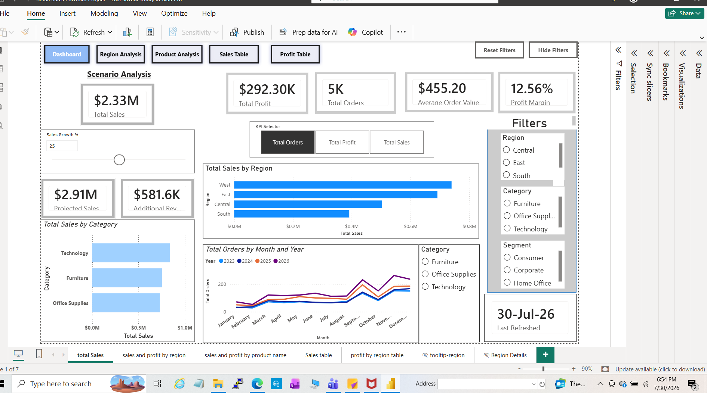
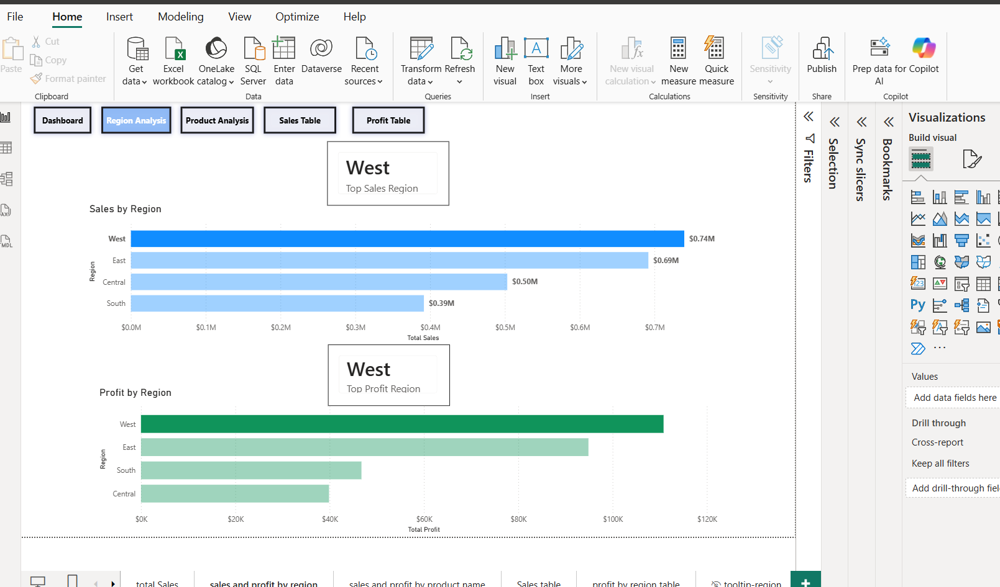
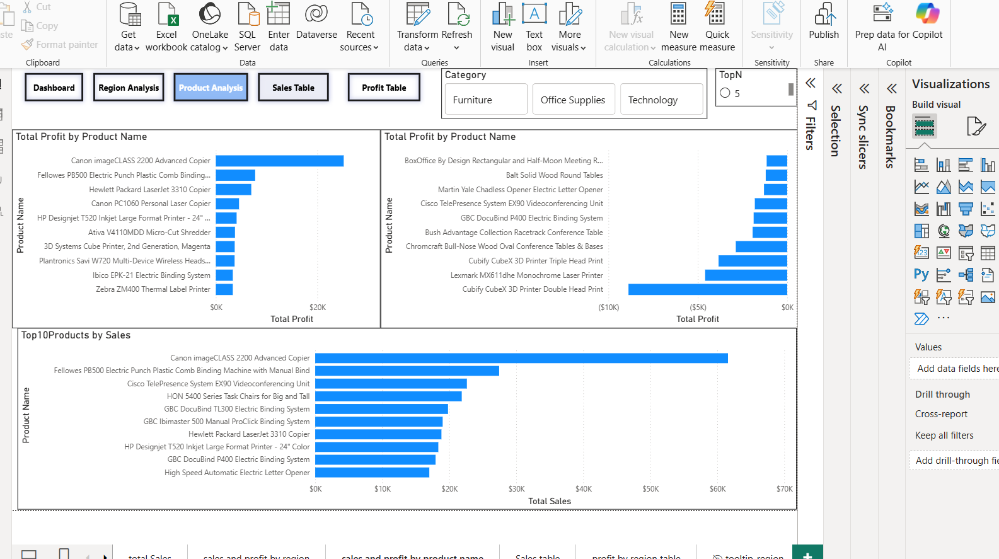

# Retail Sales Analytics Dashboard

An interactive Power BI portfolio project that transforms retail transaction data into clear insights about sales, profitability, regional performance, product performance, and future growth scenarios.

## Project Overview

This project uses the Sample Superstore dataset to answer practical business questions:

- How are sales, profit, orders, and profit margin performing?
- Which regions generate the most sales and profit?
- Which product categories and individual products perform best?
- Which products generate losses and require attention?
- How would projected sales change under different growth assumptions?

The report was designed for managers who need a quick executive overview as well as detailed regional and product-level analysis.

## Dashboard Preview



## Key Results

- **Total Sales:** $2.33M
- **Total Profit:** $292.30K
- **Total Orders:** approximately 5K
- **Average Order Value:** $455.20
- **Profit Margin:** 12.56%
- **Top Sales Region:** West
- **Top Profit Region:** West
- Technology generated the highest category sales.
- Product analysis revealed that strong sales do not always produce strong profit, highlighting loss-making products that require further review.

## Report Pages

### 1. Executive Dashboard

- Core KPI cards for sales, profit, orders, average order value, and profit margin
- Dynamic KPI selector created with field parameters
- What-if sales growth analysis
- Projected sales and additional revenue calculations
- Sales trends by month and year
- Region, category, and segment filters
- Reset-filter and show/hide-filter bookmarks
- Last-refreshed indicator

### 2. Region Analysis

- Sales and profit comparison by region
- Top sales region and top profit region indicators
- Conditional highlighting for the leading region



### 3. Product Analysis

- Most profitable products
- Least profitable and loss-making products
- Dynamic Top N product analysis
- Category-based filtering
- Dynamic chart titles



### 4. Supporting Detail Pages

- Sales table
- Profit table with conditional formatting
- Drill-through region details
- Custom report tooltip

## Interactive Features

- Field parameters
- What-if parameter
- Dynamic Top N selection
- Dynamic titles
- Drill-through navigation
- Report-page tooltips
- Synced slicers
- Bookmarks and navigation buttons
- Show/hide filter panel
- Reset filters
- Conditional formatting

## Tools and Skills

- **Power BI Desktop** — report development and data visualization
- **Power Query** — data cleaning and transformation
- **DAX** — calculated measures and interactive business logic
- **Data modelling** — relationships between Orders, People, and Returns data
- **Microsoft Excel** — source-data preparation
- **Business intelligence** — KPI selection and insight communication
- **Dashboard design** — layout, navigation, consistency, and usability

## Selected DAX Measures

- Total Sales
- Total Profit
- Total Orders
- Average Order Value
- Profit Margin
- Projected Sales
- Additional Revenue
- Product Rank
- Selected Top N
- Dynamic Title
- Top Sales Region
- Top Profit Region
- Last Refreshed

## Project Files

```text
retail-sales-analytics-power-bi/
├── Retail Sales Portfolio Project.pbix
├── README.md
├── images/
│   ├── dashboard.png
│   ├── region-analysis.png
│   └── product-analysis.png
└── demo/
    └── Retail-Sales-Dashboard-Demo.mp4
```

## View the Project

1. Download `Retail Sales Portfolio Project.pbix`.
2. Open it using Power BI Desktop.
3. Use the navigation buttons to move between report pages.
4. Test the KPI selector, growth scenario, filters, drill-through, tooltips, and Top N controls.

[Watch the dashboard demonstration](demo/Retail-Sales-Dashboard-Demo.mp4)

## About Me

I am building a data analytics portfolio focused on using Excel, SQL, Power BI, Power Query, and DAX to solve practical business problems. I am currently seeking entry-level Data Analyst and Business Analyst opportunities in Canada.

## Contact

**Chandrakala Saini**  
[GitHub Profile](https://github.com/saini2992)

---

If you found this project useful, please consider starring the repository.